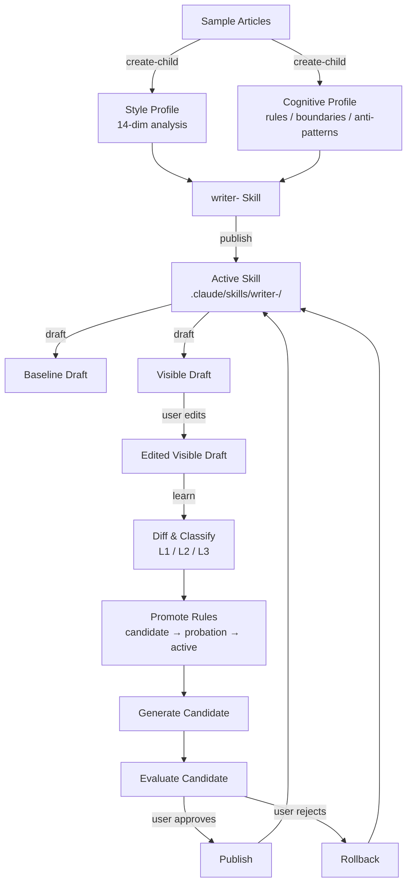
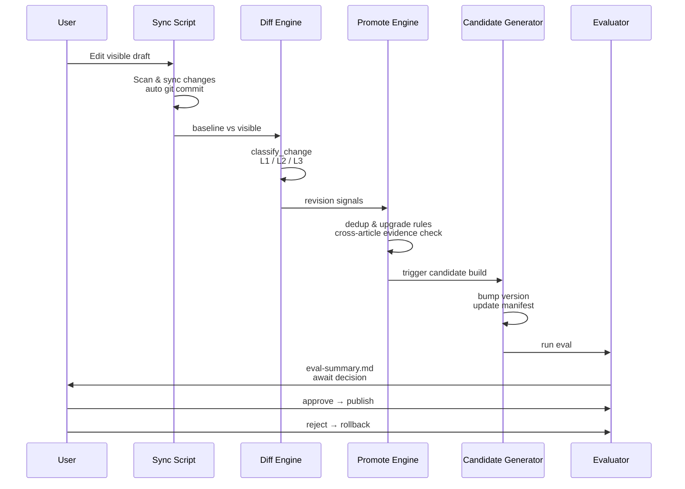

[English](README.md) | [中文](README_zh.md)

# Writing Skill Factory Claude

> A Claude Code-native skill factory that distills an author's writing style from sample articles and generates a versioned, learnable `writer-<child-name>` skill.


---

## Introduction

**Writing Skill Factory Claude** is a parent skill system for [Claude Code](https://claude.ai/code) that transforms raw sample articles into a fully structured, callable writing skill. Instead of one-shot prompt engineering, it builds a **persistent, versioned writer child** that can draft articles, learn from your edits, and evolve over time.

The system follows a **"distill → publish → draft → learn → evaluate → release"** loop, ensuring every style update is tracked, testable, and reversible.

### What Makes It Different

- **High-resolution style profiling**: 14-dimension quantitative analysis (sentence length, paragraph formulas, narrative moves, punctuation preferences, etc.)
- **Cognitive distillation**: Extracts not just "what it sounds like" but "how the author thinks, decides, and draws boundaries"
- **Dual-write integrity**: Every draft generates both an internal baseline and a user-editable visible copy
- **Incremental learning**: Your edits on the visible draft are automatically diffed, classified, and promoted into structured rules
- **Human-in-the-loop releases**: No automatic overwrites—every update produces a candidate, runs evaluations, and waits for your approval

---

## Features

| Capability | Description |
|------------|-------------|
| `create-child` | Generate a complete writer skill from 3–10 sample articles |
| `draft-with-child` | Produce articles via the active child with automatic dual-write (baseline + visible) |
| `learn-from-visible-edits` | Sync user edits, diff against baseline, and extract reusable style rules |
| `evaluate-candidate` | Structure + effect dual-track assessment before any release |
| `publish-child` | Promote a candidate to the active skill with a versioned git tag |
| `rollback-child` | Revert to any previous stable release instantly |
| `status` | Inspect releases, candidates, rules, learning history, and evals |

### Built-in Quality Safeguards

- **Semantic diff classification** (L1 Cosmetic / L2 Reusable Preference / L3 Structural Rule)
- **Confidence buckets** (candidate → probation → active) with cross-article evidence requirements
- **Automated regression tests** (14 test scenarios covering integrity, schema, sensitivity, and pipeline dry-runs)
- **Structured logging** (JSON + human-readable console output)
- **Git-native versioning** for every child’s canonical repository

---

## Workflow

### End-to-End Lifecycle



### Learn Pipeline Detail



---

## Installation

### Prerequisites

- Python 3.10+
- Git
- [Claude Code](https://claude.ai/code) CLI
- Conda (recommended)

### Setup

```bash
# 1. Clone the repository
git clone https://github.com/your-username/writing-skill-factory-claude.git
cd writing-skill-factory-claude

# 2. Create and activate the Conda environment
conda create -n WritingSkillFactory python=3.11 -y
conda activate WritingSkillFactory

# 3. Install dependencies
pip install -r requirements.txt

# 4. Place the parent skill where Claude Code can find it
mkdir -p .claude/skills
cp -r writing-skill-factory-claude .claude/skills/
```

### Directory Layout

```text
.claude/
├── skills/
│   ├── writing-skill-factory-claude/     # Parent skill (this project)
│   └── writer-<child-name>/           # Active child skill (generated)
└── writing-factory/
    └── children/
        └── <child-name>/
            ├── repo/                  # Canonical git source
            │   ├── skill/             # Child skill files
            │   ├── state/             # Baselines, manifests, logs
            │   └── reports/           # Evals, changelogs
            └── workspace/
```

---

## Quick Start

### 1. Create a Writer Child

Prepare a folder with 3–10 sample articles in `.md` or `.txt` format, then:

```bash
# Via Claude Code skill
/writing-skill-factory create "my-writer" "./samples/"

# Or directly via script
python scripts/create_child.py my-writer ./samples/ \
    --factory-dir .claude/writing-factory/children
```

This generates:
- A canonical git repo under `.claude/writing-factory/children/my-writer/repo/`
- Style profile (`references/style-profile.md`)
- Cognitive profile (`references/editorial-rules.md`, `author-boundary.md`, `anti-patterns.md`)
- A draft skill ready for evaluation

### 2. Publish the Child

```bash
/writing-skill-factory publish "my-writer"
# → Active skill now available at .claude/skills/writer-my-writer/
```

### 3. Draft an Article

```bash
/writing-skill-factory draft "my-writer" "The Future of AI Agents"
```

This creates:
- `state/baselines/<article-id>.md` (internal baseline)
- `my-writer_Generated_Articles/<article-id>__the-future-of-ai-agents.md` (editable visible draft)
- `.manifest/<article-id>.json` (metadata sidecar)

### 4. Learn from Your Edits

Edit the visible draft in your IDE, then:

```bash
/writing-skill-factory learn "my-writer"
```

The pipeline automatically:
1. Syncs visible edits back to the canonical repo
2. Diffs against baseline
3. Classifies changes and promotes rules
4. Generates a versioned candidate
5. Runs evaluation and produces a report

### 5. Evaluate & Release

```bash
/writing-skill-factory eval "my-writer"
# Review reports/eval-summary.md, then:

/writing-skill-factory publish "my-writer"   # Approve candidate
/writing-skill-factory rollback "my-writer" "1.0.0"  # Or revert
```

### 6. Check Status

```bash
/writing-skill-factory status "my-writer"
```

Shows releases, candidates, rule counts, learning history, and latest evals.

---

## Scripts Reference

| Script | Purpose |
|--------|---------|
| `create_child.py` | Bootstrap canonical repo and first-version skill skeleton |
| `build_style_profile.py` | 14-dimension style extraction from samples |
| `build_cognitive_profile.py` | Editorial rules, boundaries, and anti-patterns |
| `generate_article.py` | Prepare dual-write structure (baseline + visible) |
| `sync_visible_edits.py` | Sync user edits from visible directory to canonical repo |
| `diff_revision.py` | Semantic diff and L1/L2/L3 classification |
| `promote_rules.py` | Rule deduplication and confidence bucket upgrades |
| `generate_candidate.py` | Version-bump and candidate manifest generation |
| `eval_candidate.py` | Structure + effect evaluation with scoring |
| `publish_child.py` | Sync canonical skill to active `.claude/skills/` |
| `rollback_child.py` | Git-checkout previous release and republish |
| `learn_pipeline.py` | Unified entry: sync → diff → promote → candidate → eval |
| `show_status.py` | Human-readable (or JSON) status report |
| `prune_rules.py` | Clean stale / low-evidence rules |
| `run_regression_tests.py` | Automated regression suite (14 scenarios) |
| `factory_logging.py` | Shared structured logging infrastructure |

---

## Architecture

For a deep dive into data flows, file responsibilities, and versioning policies, see:

- [`references/architecture.md`](writing-skill-factory-claude/references/architecture.md)
- [`references/version-policy.md`](writing-skill-factory-claude/references/version-policy.md)

## Authors

- **ice268528** — Creator & maintainer

## License

MIT