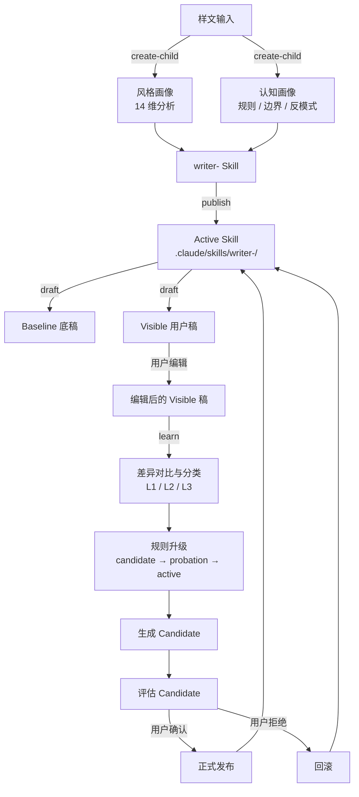
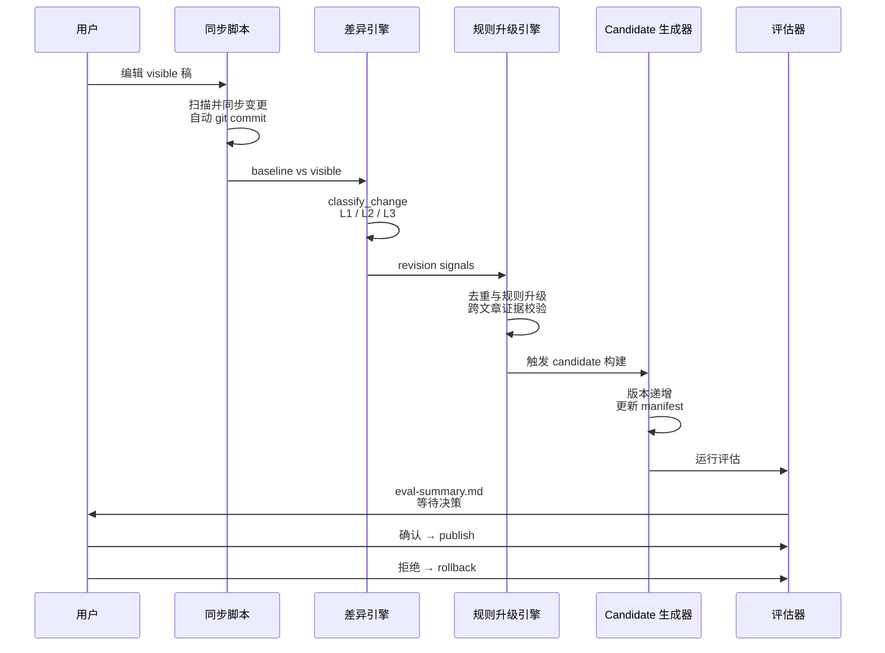

[English](README.md) | [中文](README_zh.md)

# Writing Skill Factory Claude

> 面向 Claude Code 的原生 Skill 工厂，从样文蒸馏作者写作风格，生成可版本化、可持续学习的 `writer-<child-name>` 子 Skill。


---

## 项目简介

**Writing Skill Factory Claude** 是一套为 [Claude Code](https://claude.ai/code) 设计的父级 Skill 系统。它能将原始样文转化为一套结构完整、可被直接调用的写作 Skill。区别于一次性 Prompt 工程，它构建的是一个**可持续版本化、可增量学习**的写作者子 Skill。

系统遵循 **"蒸馏 → 发布 → 写稿 → 学习 → 评估 → 发布/回滚"** 的完整闭环，确保每一次风格更新都有迹可循、可测试、可回退。

### 核心差异点

- **高分辨率风格画像**：14 维量化分析（句长、段落配方、叙述动作、标点偏好等）
- **认知层蒸馏**：不仅提取"像不像"，更提取"作者怎么想、怎么判断、边界在哪"
- **双写完整性**：每次出稿同时生成内部 baseline 与用户可编辑的 visible 稿
- **增量学习**：用户在 visible 稿上的修改会被自动对比、分类，并提升为结构化规则
- **人在回路发布**：绝不自动覆盖现有版本，每次更新都生成 candidate、运行评估、等待用户裁决

---

## 功能特性

| 能力 | 说明 |
|------|------|
| `create-child` | 从 3–10 篇样文生成完整的写作者 Skill |
| `draft-with-child` | 通过 active child 生成文章，自动双写（baseline + visible） |
| `learn-from-visible-edits` | 同步用户编辑，与 baseline 对比，抽取可复用的风格规则 |
| `evaluate-candidate` | 结构与效果双轨评估，发布前必经关卡 |
| `publish-child` | 将 candidate 提升为 active Skill，并打上版本化 git tag |
| `rollback-child` | 一键回滚到任意历史稳定版本 |
| `status` | 查看版本、候选、规则、学习记录、评估报告 |

### 内置质量保障

- **语义差异分级**（L1 表面修饰 / L2 可复用偏好 / L3 结构性规则）
- **置信度分层**（candidate → probation → active），升级需跨文章证据支撑
- **自动化回归测试**（14 个测试场景，覆盖完整性、Schema、敏感度、Pipeline 空跑）
- **结构化日志**（JSON 文件 + 控制台人类可读输出）
- **Git 原生版本控制**，每个 child 的 canonical 仓库全程受 Git 管理

---

## 工作流可视化

### 端到端生命周期



### Learn 流程细节



---

## 安装

### 前置要求

- Python 3.10+
- Git
- [Claude Code](https://claude.ai/code) CLI
- Conda（推荐）

### 安装步骤

```bash
# 1. 克隆仓库
git clone https://github.com/your-username/writing-skill-factory-claude.git
cd writing-skill-factory-claude

# 2. 创建并激活 Conda 环境
conda create -n WritingSkillFactory python=3.11 -y
conda activate WritingSkillFactory

# 3. 安装依赖
pip install -r requirements.txt

# 4. 将父 Skill 放置到 Claude Code 可发现的位置
mkdir -p .claude/skills
cp -r writing-skill-factory-claude .claude/skills/
```

### 目录结构

```text
.claude/
├── skills/
│   ├── writing-skill-factory-claude/     # 父 Skill（本项目）
│   └── writer-<child-name>/           # 已激活的子 Skill（自动生成）
└── writing-factory/
    └── children/
        └── <child-name>/
            ├── repo/                  # Canonical Git 仓库（唯一真相源）
            │   ├── skill/             # 子 Skill 文件
            │   ├── state/             # Baselines、清单、日志
            │   └── reports/           # 评估报告、变更日志
            └── workspace/
```

---

## 快速开始

### 1. 创建写作者子 Skill

准备一个包含 3–10 篇样文的文件夹（支持 `.md` 或 `.txt`），然后：

```bash
# 通过 Claude Code Skill 调用
/writing-skill-factory create "my-writer" "./samples/"

# 或直接运行脚本
python scripts/create_child.py my-writer ./samples/ \
    --factory-dir .claude/writing-factory/children
```

此命令会生成：
- Canonical 仓库：`.claude/writing-factory/children/my-writer/repo/`
- 风格画像：`references/style-profile.md`
- 认知画像：`references/editorial-rules.md`、`author-boundary.md`、`anti-patterns.md`
- 待评估的初版 Skill

### 2. 发布子 Skill

```bash
/writing-skill-factory publish "my-writer"
# → Active Skill 已发布到 .claude/skills/writer-my-writer/
```

### 3. 生成文章

```bash
/writing-skill-factory draft "my-writer" "AI Agent 的未来"
```

此命令会创建：
- `state/baselines/<article-id>.md`（内部底稿）
- `my-writer_Generated_Articles/<article-id>__ai-agent-de-wei-lai.md`（用户可编辑稿）
- `.manifest/<article-id>.json`（元数据 sidecar）

### 4. 从编辑中学习

在 IDE 中直接编辑 visible 稿，完成后运行：

```bash
/writing-skill-factory learn "my-writer"
```

Pipeline 会自动完成：
1. 将 visible 编辑同步回 canonical repo
2. 与 baseline 进行差异对比
3. 分类变更并升级规则
4. 生成版本化 candidate
5. 运行评估并生成报告

### 5. 评估与发布

```bash
/writing-skill-factory eval "my-writer"
# 查阅 reports/eval-summary.md 后执行：

/writing-skill-factory publish "my-writer"        # 确认发布 candidate
/writing-skill-factory rollback "my-writer" "1.0.0"  # 或回滚到旧版本
```

### 6. 查看状态

```bash
/writing-skill-factory status "my-writer"
```

展示版本列表、候选版本、规则统计、学习历史与最新评估结果。

---

## 脚本参考

| 脚本 | 用途 |
|------|------|
| `create_child.py` | 初始化 canonical 仓库与首版 Skill 骨架 |
| `build_style_profile.py` | 从样文提取 14 维风格画像 |
| `build_cognitive_profile.py` | 生成编辑规则、边界与反模式 |
| `generate_article.py` | 准备双写文件结构（baseline + visible） |
| `sync_visible_edits.py` | 将用户编辑从 visible 目录同步到 canonical repo |
| `diff_revision.py` | 语义差异分析与 L1/L2/L3 分级 |
| `promote_rules.py` | 规则去重与置信度分层升级 |
| `generate_candidate.py` | 版本递增与 candidate 清单生成 |
| `eval_candidate.py` | 结构与效果双维度评分评估 |
| `publish_child.py` | 将 canonical Skill 同步到 active `.claude/skills/` |
| `rollback_child.py` | 检出历史 release 并重新发布 |
| `learn_pipeline.py` | 统一入口：sync → diff → promote → candidate → eval |
| `show_status.py` | 人类可读（或 JSON）状态报告 |
| `prune_rules.py` | 清理过时 / 低置信度规则 |
| `run_regression_tests.py` | 自动化回归测试套件（14 个场景） |
| `factory_logging.py` | 共享的结构化日志基础设施 |

---

## 架构说明

关于数据流、文件职责与版本策略的深入说明，请参阅：

- [`references/architecture.md`](references/architecture.md)
- [`references/version-policy.md`](references/version-policy.md)

## License

MIT